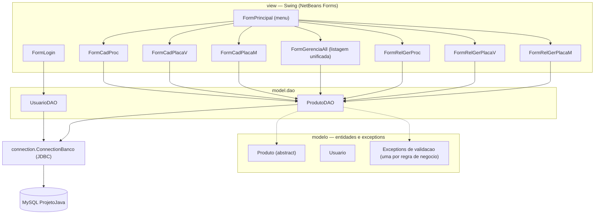
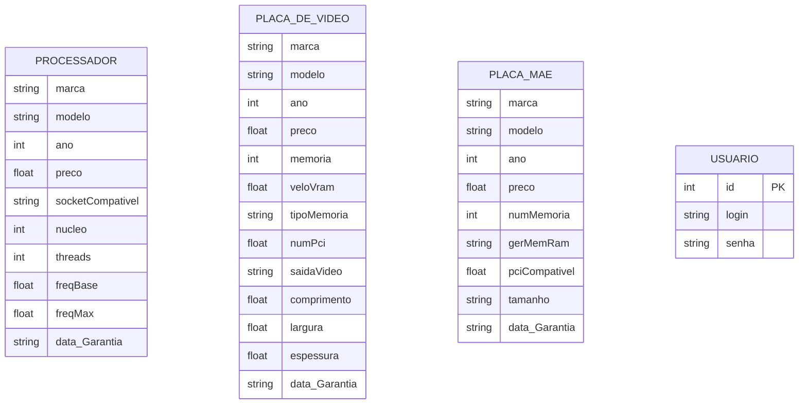

# Sistema de Cadastro de Componentes de Hardware

Aplicação desktop em Java para gerenciamento de estoque de componentes de hardware (processadores, placas de vídeo e placas-mãe), com persistência em MySQL via JDBC. Desenvolvido como projeto acadêmico, evoluindo uma versão anterior sem banco de dados para uma aplicação com CRUD completo e validações de negócio específicas por tipo de componente.


-orange?style=flat)


-A81C7D?style=flat&logo=apacheant&logoColor=white)


## Sumário

- [Visão Geral](#visão-geral)
- [Funcionalidades](#funcionalidades)
- [Arquitetura](#arquitetura)
- [Modelo de Dados](#modelo-de-dados)
- [Tecnologias](#tecnologias)
- [Como Executar](#como-executar)
- [Fluxo de Uso](#fluxo-de-uso)
- [Regras de Negócio](#regras-de-negócio)
- [Estrutura de Pastas](#estrutura-de-pastas)
- [Segurança](#segurança)
- [Limitações e Próximos Passos](#limitações-e-próximos-passos)
- [Evolução do Projeto](#evolução-do-projeto)
- [Criador](#criador)
- [Licença](#licença)

## Visão Geral

O sistema permite cadastrar, consultar, atualizar e remover três tipos de componentes de hardware — **processadores**, **placas de vídeo** e **placas-mãe** — cada um com seus próprios atributos técnicos e regras de validação. O acesso é protegido por uma tela de login, e uma tela de gerenciamento unificada permite listar e buscar todos os produtos cadastrados independentemente do tipo.

A aplicação é um projeto desktop Java/Swing (NetBeans), com camada de acesso a dados isolada em DAOs e persistência em MySQL via JDBC puro (sem uso de ORM). O foco do projeto é a aplicação de conceitos de Programação Orientada a Objetos — herança, polimorfismo (sobrecarga e sobrescrita de métodos) e exceptions customizadas para regras de negócio.

## Funcionalidades

**Autenticação**
- Login via tela dedicada (`FormLogin`), validando usuário e senha contra a tabela `Usuario`

**Cadastro de Componentes** (uma tela dedicada para cada tipo, com os botões Cadastrar / Consultar / Alterar / Remover / Buscar)
- **Processador** — marca, modelo, ano, preço, socket compatível, núcleos, threads, frequência base e máxima
- **Placa de Vídeo** — marca, modelo, ano, preço, memória (GB), velocidade da VRAM, tipo de memória, versão do PCI, saída de vídeo e dimensões físicas (comprimento, largura, espessura)
- **Placa-Mãe** — marca, modelo, ano, preço, número de canais de memória, geração de RAM suportada, versão do PCI compatível e tamanho do formato (ATX, Micro-ATX etc.)
- Consulta e atualização feitas pela combinação marca + modelo (chave de busca usada nas cláusulas `WHERE`)

**Gerenciamento Geral**
- Listagem unificada de todos os componentes (`UNION ALL` entre as três tabelas) em uma única tabela
- Busca por marca (`LIKE`) que também cruza as três tabelas de uma vez

**Relatórios**
- Uma tela de relatório por tipo de componente (Processador, Placa de Vídeo, Placa-Mãe), listando os registros daquela categoria em uma `JTable`

## Arquitetura



A camada `view` concentra toda a interface Swing (telas geradas pelo editor visual do NetBeans, arquivos `.form` + `.java`). As DAOs (`model.dao`) são as únicas classes que montam SQL e conversam com o banco; elas dependem de `connection.ConnectionBanco` para abrir e fechar conexões JDBC. A camada `modelo` concentra as entidades e uma exception customizada para cada regra de validação de negócio.

## Modelo de Dados



As três tabelas de componentes não possuem chave primária própria no código analisado — consultas, atualizações e remoções são feitas pela combinação **marca + modelo**. `Usuario` é independente das demais tabelas (usada apenas para autenticação, sem relação de posse sobre os componentes).

## Tecnologias

| Tecnologia | Versão | Função |
|---|---|---|
| Java | 24 | Linguagem e ambiente de execução |
| Swing | — | Interface gráfica (telas geradas no NetBeans GUI Builder) |
| MySQL | 8 | Banco de dados relacional |
| JDBC | mysql-connector-j 9.5.0 | Conexão e execução de SQL |
| Apache Ant (NetBeans) | — | Build do projeto (`build.xml` + `nbproject/`) |

Não há uso de ORM (Hibernate/JPA) nem de frameworks de injeção de dependência — todo o acesso a dados é feito com `PreparedStatement` puro nas classes DAO.

## Como Executar

### Pré-requisitos

- JDK 24
- MySQL 8 (local ou em container)
- NetBeans IDE (recomendado, pela dependência dos arquivos `.form`) ou Apache Ant na linha de comando
- Driver `mysql-connector-j-9.5.0.jar`

### 1. Banco de dados

```sql
CREATE DATABASE ProjetoJava;

USE ProjetoJava;

CREATE TABLE Usuario (
    id INT AUTO_INCREMENT PRIMARY KEY,
    login VARCHAR(50) NOT NULL,
    senha VARCHAR(50) NOT NULL
);

CREATE TABLE Processador (
    marca VARCHAR(50),
    modelo VARCHAR(50),
    ano INT,
    preco FLOAT,
    socketCompativel VARCHAR(20),
    nucleo INT,
    threads INT,
    freqBase FLOAT,
    freqMax FLOAT,
    data_Garantia VARCHAR(20)
);

CREATE TABLE PlacaDeVideo (
    marca VARCHAR(50),
    modelo VARCHAR(50),
    ano INT,
    preco FLOAT,
    memoria INT,
    veloVram FLOAT,
    tipoMemoria VARCHAR(20),
    numPci FLOAT,
    saidaVideo VARCHAR(50),
    comprimento FLOAT,
    largura FLOAT,
    espessura FLOAT,
    data_Garantia VARCHAR(20)
);

CREATE TABLE PlacaMae (
    marca VARCHAR(50),
    modelo VARCHAR(50),
    ano INT,
    preco FLOAT,
    numMemoria INT,
    gerMemRam VARCHAR(10),
    pciCompativel FLOAT,
    tamanho VARCHAR(20),
    data_Garantia VARCHAR(20)
);

-- usuário de acesso (não há seed automático no projeto)
INSERT INTO Usuario (login, senha) VALUES ('admin', '123456');
```

> ⚠️ O DDL acima foi reconstruído a partir das colunas usadas nas queries das DAOs — ajuste tipos e tamanhos conforme sua necessidade.

### 2. Configurar a conexão

Edite `src/connection/ConnectionBanco.java` com as credenciais do seu MySQL local:

```java
private static final String URL = "jdbc:mysql://localhost:3306/ProjetoJava";
private static final String USER = "root";
private static final String PASS = "SUA_SENHA_AQUI";
```

### 3a. Rodar pelo NetBeans (recomendado)

1. Abra o projeto no NetBeans (`File > Open Project`)
2. Adicione o `mysql-connector-j-9.5.0.jar` às bibliotecas do projeto, caso não esteja resolvido automaticamente
3. Rode o projeto (`Run > Run Project` ou F6) — a classe de entrada é `view.FormLogin`

### 3b. Rodar via linha de comando (Ant)

```bash
ant run
```

O `build.xml` do projeto delega para os targets padrão gerados pelo NetBeans em `nbproject/build-impl.xml` (compilação, empacotamento e execução).

## Fluxo de Uso

1. **Login** — informe usuário e senha cadastrados na tabela `Usuario`
2. **Menu Principal** — dois grupos de opções: **Cadastro** (abre a tela de CRUD do tipo de componente escolhido) e **Relatório Geral** (abre a listagem daquele tipo)
3. **Tela de Cadastro** — preencha os campos e use Cadastrar / Consultar / Alterar / Remover; a busca por marca (Buscar Like) filtra a tabela de gerenciamento geral
4. **Gerenciamento Geral** — visualização consolidada de todos os componentes cadastrados, com busca por marca cruzando os três tipos

## Regras de Negócio

Cada setter de `Produto` e das subclasses lança uma exception própria quando o valor não é válido — a validação ocorre tanto no cadastro quanto na leitura dos dados vindos do banco:

- **Ano** — produtos anteriores a 2015 são rejeitados
- **Preço** — deve ser maior que zero
- **Marca** — validada contra uma lista fixa de fabricantes válidos, específica por tipo de componente (ex: processador aceita apenas `INTEL` ou `AMD`; placa-mãe aceita `INTEL`, `GIGABYTE`, `MSI`, `ASROCK`, entre outras)
- **Modelo (Processador)** — precisa ser compatível com a marca informada (ex: modelos AMD devem começar com `RYZEN`, `ATHLON`, `A12`, `A10` etc.; modelos Intel com `CORE`, `PENTIUM`, `CELERON`)
- **Socket (Processador)** — restrito por marca: Intel aceita `LGA 1151/1155/1200/1700`; AMD aceita `AM4`/`AM5`
- **Núcleos e Threads (Processador)** — ambos devem ser maiores que zero, e a quantidade de threads não pode ser menor que a de núcleos
- **Frequência base e máxima (Processador)** — devem ser maiores que zero, e a frequência máxima não pode ser menor que a base
- **Geração de RAM (Placa-Mãe)** — restrita a `DDR3`, `DDR4` ou `DDR5`
- **PCI compatível (Placa-Mãe / Placa de Vídeo)** — restrito às versões `3.0`, `4.0` ou `5.0`
- **Tamanho (Placa-Mãe)** — restrito a `EATX`, `ATX`, `MICRO-ATX` ou `MINI-ATX`
- **Tipo de memória (Placa de Vídeo)** — restrito a `GDDR4` até `GDDR7`
- **Memória e velocidade da VRAM (Placa de Vídeo)** — devem ser maiores que zero
- Todas as strings de marca/modelo/atributos categóricos são normalizadas para maiúsculas antes de persistir

## Estrutura de Pastas

```
java-crud-mysql/
├── src/
│   ├── connection/
│   │   └── ConnectionBanco.java      # Abertura/fechamento de conexão JDBC
│   ├── model/
│   │   └── dao/
│   │       ├── ProdutoDAO.java        # CRUD de Processador, PlacaDeVideo e PlacaMae
│   │       └── UsuarioDAO.java        # Validação de login
│   ├── modelo/
│   │   ├── Produto.java               # Classe abstrata base (marca, modelo, ano, preço, garantia)
│   │   ├── Processador.java
│   │   ├── PlacaDeVideo.java
│   │   ├── PlacaMae.java
│   │   ├── Dimensao.java              # Comprimento/largura/espessura (usado em PlacaDeVideo)
│   │   ├── Garantia.java              # Interface para o campo de data de garantia
│   │   ├── Usuario.java
│   │   └── *Exception.java            # Uma exception por regra de validação
│   └── view/
│       ├── FormLogin.*
│       ├── FormPrincipal.*             # Menu principal
│       ├── FormCadProc.* / FormCadPlacaV.* / FormCadPlacaM.*   # Telas de cadastro (CRUD)
│       ├── FormGerenciaAll.*           # Listagem unificada + busca por marca
│       └── FormRelGerProc.* / FormRelGerPlacaV.* / FormRelGerPlacaM.*  # Relatórios por tipo
├── nbproject/                          # Metadados de build do NetBeans
├── build.xml                           # Build Ant (delega para nbproject/build-impl.xml)
└── manifest.mf
```

## Segurança

Este projeto tem finalidade acadêmica e, no estado atual, **não deve ser usado como referência de segurança**:

- A senha do banco de dados está gravada em texto plano diretamente em `ConnectionBanco.java`
- As senhas de usuário são comparadas em texto plano (`SELECT ... WHERE senha = ?`), sem hash
- O uso de `PreparedStatement` já mitiga o principal risco de SQL injection, mas não há sanitização adicional de entrada nos formulários
- O driver configurado na string (`com.mysql.jdbc.Driver`) é o driver legado do MySQL Connector/J; a versão do JAR referenciada no projeto (9.5.0) já usa o driver mais novo (`com.mysql.cj.jdbc.Driver`), o que pode gerar apenas um aviso de depreciação, mas funciona por compatibilidade

## Limitações e Próximos Passos

- Ausência de chave primária/identificador único nas tabelas de produto — operações de consulta, atualização e remoção dependem da combinação marca + modelo, o que impede cadastrar dois itens idênticos e tem custo de manutenção mais alto
- Credenciais de banco hardcoded no código-fonte, sem uso de arquivo de configuração externo ou variáveis de ambiente
- Sem hashing de senha para o login
- Sem suíte de testes automatizados
- Sem pipeline de CI/CD configurado
- Próximos passos possíveis: adicionar chave primária (`id`) autoincrementável às tabelas de produto; externalizar configuração de conexão; aplicar hash de senha (bcrypt); adicionar testes unitários para as regras de validação em `modelo`

## Evolução do Projeto

Este projeto é a evolução de uma versão anterior sem persistência em banco de dados:

👉 https://github.com/Yakino41/java-crud-desktop

## Criador

**Arthur Gabriel Teotonio Stellato**
[GitHub](https://github.com/Yakino41)

## Licença

Projeto desenvolvido para fins acadêmicos.
